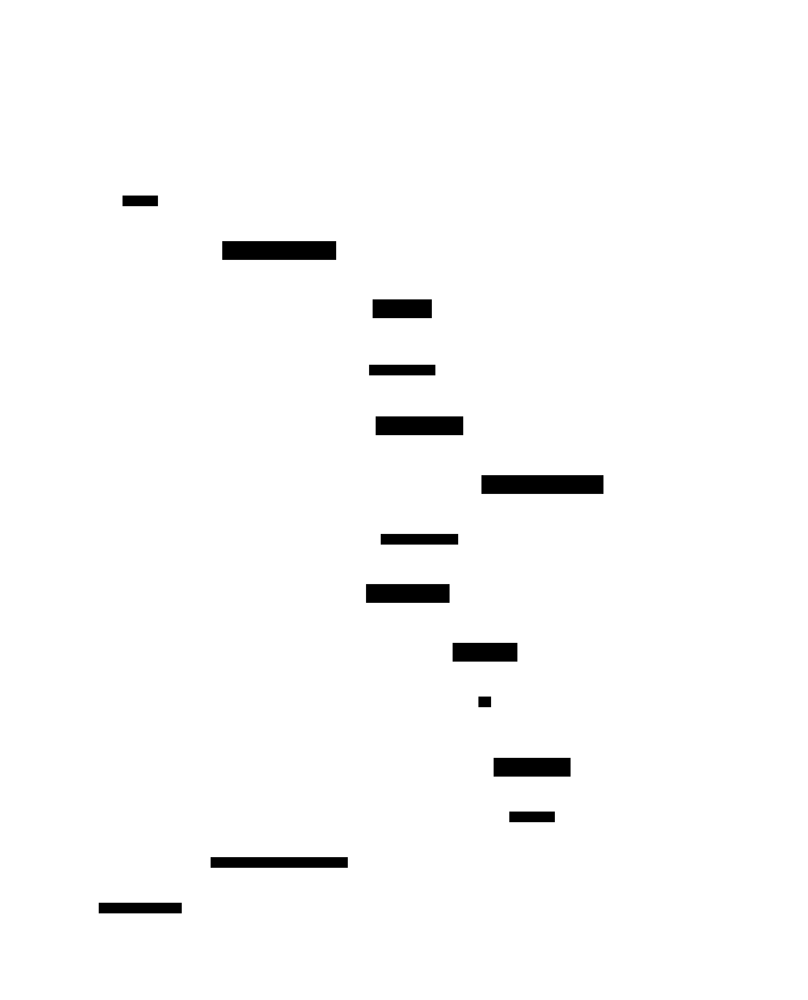
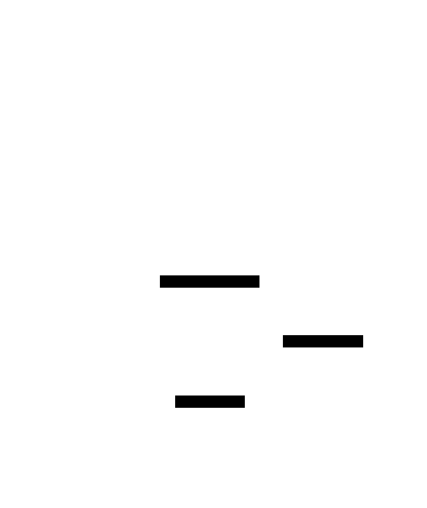
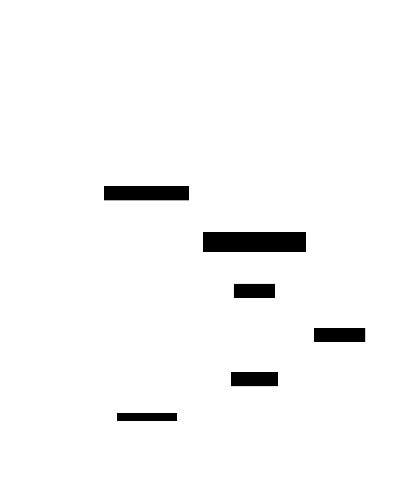

ifndef::imagesdir[:imagesdir: ../images]

[[section-runtime-view]]
== Runtime View

The runtime view describes the behaviour and interactions of the system's building blocks through
selected scenarios. It captures how the TypeScript services (`game`, `users`) and the Rust engine
(`gamey`) cooperate to fulfil the requirements.

=== Human vs Computer Match

This scenario references the high-level requirement: _Classic version of Game Y, player-vs-machine
mode._
It covers the complete server-side round trip that occurs when a human player makes a move in a PvE
game session.

==== Quality Context
[cols="1,3"]
|===
| **Source** | Human Player
| **Stimulus** | Selects a position on the board via the Web Frontend
| **Artifact** | System (`game` service + `gamey` Rust engine)
| **Environment** | Normal operation, active PvE game session
| **Response** | The move is validated, the bot responds, the state is persisted, and the full
  updated board is returned to the frontend in a single round trip
| **Response Measure** | The UI reflects the new state (human move + bot move) in under 500 ms
  for medium difficulty (`fast_bot`)
|===

==== Interaction sequence

*1.* The User selects a cell on the board via the Web Frontend.

*2.* The Frontend sends `POST /game/api/games/{id}/move` to the `game` service with `{ row, col, player }`.

*3.* The `game` service validates the move: it checks that the game is active, the player's turn is
correct, and the target cell is unoccupied. A `409 Conflict` is returned immediately if any check
fails.

*4.* The `game` service applies the human player's move to the in-memory board state.

*5.* In PvE mode, the `game` service encodes the updated board in YEN notation and calls `gamey`
(`POST /ybot/choose/{botId}`) to obtain the bot's response. The bot identifier is determined by the
session's configured difficulty level: `random_bot` (easy), `fast_bot` (medium), or `smart_bot`
(hard).

*6.* `gamey` computes the next move using the selected strategy within its time budget and returns
the chosen cell coordinate.

*7.* The `game` service applies the bot's move to the board state and evaluates the win condition.

*8.* The `game` service persists the updated board state, current turn, winner (if any), and both
move records to MariaDB.

*9.* If the game has ended, the `game` service posts the match result to the `users` service
(via `USERS_SERVICE_URL`) so that it is recorded in the `match_records` table.

*10.* The `game` service returns the complete, updated `GameState` JSON — containing the post-bot-move
board, status, winner, and timer — to the Frontend in a single HTTP response.

*11.* The Frontend renders the new board state and displays the game result or continues awaiting
the next player input.

=== User Registration and History Consultation

This scenario references the high-level requirement: _Users will be able to register and consult
their participation history._
It describes how a user creates an account and later views their match statistics.

==== Quality Context
[cols="1,3"]
|===
| **Source** | Human Player
| **Stimulus** | Provides registration details via the Web Frontend; later requests their match
  history
| **Artifact** | System (`users` service)
| **Environment** | Normal operation
| **Response** | The user account is created and a session is established; history is retrieved from
  persistent storage and rendered
| **Response Measure** | Both operations complete and the UI reflects the new state in under 500 ms
|===

==== Interaction sequence

[cols="a,a", frame=none, grid=none]
|===
| image::../images/registration.svg[title="User registration", width=100%]
| image::../images/history.svg[title="History consultation", width=100%]
|===

*1.* The User provides registration credentials (username, e-mail, password) via the Web Frontend.

*2.* The Frontend sends `POST /users/api/auth/register` to the `users` service.

*3.* The `users` service validates the input, hashes the password with bcrypt, and writes the new
account to the `users` table in MariaDB.

*4.* The `users` service returns the created user object and a JWT to the Frontend, which stores the
token for subsequent authenticated requests.

*5.* When the registered User later requests their match history, the Frontend sends an authenticated
request to the `users` service.

*6.* The `users` service queries the `match_records` table in MariaDB for all records belonging to
the authenticated user.

*7.* The `users` service returns the raw match records (opponent, result, duration, timestamp) to
the Frontend.

*8.* The Frontend computes summary metrics (win rate, total games, etc.) and renders the history
view.

=== Computer Strategy Execution

This scenario references the high-level requirement: _The game against the computer must implement
more than one strategy, and the user shall be able to select which strategy to use._
It describes how the `game` service and `gamey` cooperate to produce the bot's response move.

==== Quality Context
[cols="1,3"]
|===
| **Source** | `game` service (triggered by a human player's move in a PvE session)
| **Stimulus** | The human move has been applied; the `game` service must obtain the bot's response
| **Artifact** | `gamey` Rust engine
| **Environment** | Normal operation
| **Response** | `gamey` selects a legal move using the strategy configured for this session and
  returns the chosen cell
| **Response Measure** | p95 ≤ 500 ms for `fast_bot` (medium); p95 ≤ 3 000 ms for `smart_bot`
  (hard), with "thinking" indicator shown in the UI
|===

==== Interaction sequence

*1.* After applying the human move, the `game` service encodes the current board state in YEN
notation (`{ size, turn, players, layout }`).

*2.* The `game` service sends `POST /ybot/choose/{botId}` to `gamey`, where `botId` is one of:
`random_bot` (easy), `fast_bot` (medium, 500 ms budget), or `smart_bot` (hard, up to 3 000 ms
budget).

*3.* `gamey` deserialises the YEN payload via its `YENAdapter` and invokes the corresponding
strategy algorithm. `fast_bot` and `smart_bot` use minimax with alpha-beta pruning and iterative
deepening; `random_bot` selects a uniformly random legal cell.

*4.* `gamey` returns the chosen move as a barycentric coordinate string (`"x,y,z"`) to the `game`
service.

*5.* The `game` service applies the bot's move and continues with win detection and state
persistence (see Human vs Computer Match, steps 7–11).

=== External Bot Interaction

This scenario references the high-level requirement: _The API will enable a bot to play against the
application. A 'play' method will be exposed, requiring at least one 'position' parameter indicating
the board state in YEN notation._
It describes how a third-party bot interacts with the system through the interop service.

==== Quality Context
[cols="1,3"]
|===
| **Source** | External Bot
| **Stimulus** | Invokes `POST /games/play` on the interop service, supplying a `position` in YEN
  notation and optionally a `bot_id` or `strategy`
| **Artifact** | interop service + `gamey` Rust engine
| **Environment** | Normal operation
| **Response** | The system validates the YEN position, computes the bot's next move via `gamey`,
  and returns it together with the updated board layout
| **Response Measure** | The interop service returns the response in YEN notation within the
  configured timeout (2 s for `random_bot`; up to 3 s for minimax strategies)
|===

==== Interaction sequence

*1.* The External Bot calls `POST /games/play` on the interop service with the request body
`{ position: YEN, bot_id?, strategy? }`.

*2.* The interop service validates the `position` field (structure, size, layout consistency). A
`400 INVALID_POSITION` error is returned immediately if the YEN object is malformed.

*3.* The interop service resolves the target bot: `bot_id` takes priority over `strategy`; if
neither is supplied, `random_bot` is used as the default.

*4.* The interop service forwards the YEN board state to `gamey` to compute the bot's move.

*5.* `gamey` calculates the next move using the resolved strategy and returns the chosen cell
coordinate.

*6.* The interop service constructs the response `{ move: "x,y,z", position: updatedLayout, bot_id }`
and returns it to the External Bot. The `position` field in the response contains the updated YEN
layout string after the bot's move has been applied.