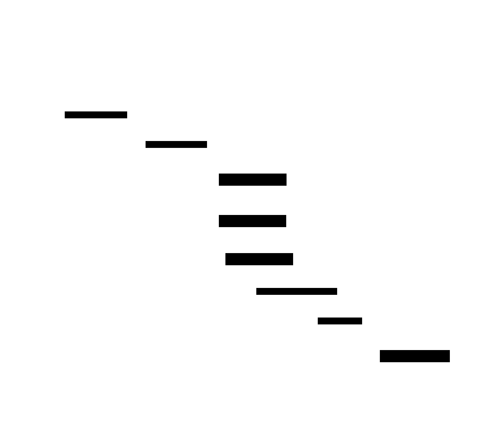

ifndef::imagesdir[:imagesdir: ../images]

[[section-deployment-view]]
== Deployment View

The deployment view describes the physical environment in which the YOVI system executes and the
automation processes that manage its lifecycle.

=== Infrastructure Level 1: Cloud Environment

The system is deployed on Microsoft Azure using the "Azure for Students" subscription. A virtual
machine with the following profile was provisioned, balancing performance against cost:

* **Location:** France Central
* **Operating System:** Linux Ubuntu
* **Hardware Profile:** Standard B2ats v2 (2 vCPUs, 1 GiB memory)

=== Infrastructure Level 2: Execution Environment (Docker)

The system follows a "Cattle not Pets" approach, using Docker containers coordinated by Docker
Compose to ensure consistency between development and production environments.

[cols="1,2,1,3", options="header"]
|===
| Container | Technology | Port | Responsibility

| `webapp`
| Nginx + React 18 (TypeScript, Vite)
| 80 / 443
| Serves the React SPA as static files and acts as the Nginx reverse proxy, routing
  `/users/` to the `users` service, `/game/` to the `game` service, and proxying Grafana and
  Prometheus paths.

| `users`
| TypeScript / Node.js 22 (Express, TypeORM)
| 3000
| Authentication, user profiles, match history, and ranking. Manages the `users` and
  `match_records` tables.

| `game`
| TypeScript / Node.js 22 (Express, TypeORM)
| 5000
| Game session management, move validation, bot orchestration, and timer enforcement. Manages the
  `games` and `game_moves` tables. Delegates bot move computation to `gamey`.

| `gamey`
| Rust (Axum)
| 4000 *(internal only)*
| Bot AI engine. Computes the next move for a given YEN board position using the configured
  strategy (random_bot, fast_bot, smart_bot). Never directly reachable from the browser.

| `mariadb`
| MariaDB 11.4
| 3306 *(internal only)*
| Persistent storage for all application data. Both `users` and `game` share the same
  `users_db` database instance.

| `prometheus`
| Prometheus
| 9090
| Metrics collection. Scrapes the `/metrics` endpoint exposed by the `users` service.

| `grafana`
| Grafana
| 9091 (host) → 3000 (container)
| Metrics visualisation dashboards, pre-provisioned via the `users/monitoring/grafana` directory.
|===

=== Network and Connectivity

The Virtual Machine is configured with a public IP and specific inbound port rules:

* **Port 80 / 443:** Public HTTPS access, handled by Nginx inside the `webapp` container. Nginx
  proxies all API traffic to the internal services:
  - `/users/` → `users` service on port 3000
  - `/game/` → `game` service on port 5000
  - `/grafana` → Grafana on port 3000 (container-internal)
  - `/prometheus` → Prometheus on port 9090
* **Port 9090:** Direct access to Prometheus metrics (restricted in production).
* **Port 9091:** Direct access to Grafana dashboards (restricted in production).
* **Port 22:** SSH access, restricted to the CI/CD deployment pipeline.
* **Ports 3000, 4000, 5000, 3306:** Internal to the Docker network (`monitor-net`); not publicly
  routed.

=== Deployment Pipeline (CI/CD)

The system uses GitHub Actions for continuous delivery. The pipeline is triggered automatically
when a new release is created or a version tag is pushed to the repository.

1. **Automation:** Workflow configuration is stored as YAML files in `.github/workflows`.
2. **Build and Test:** Docker images are built for all services; unit, integration, and SonarCloud
   quality-gate checks are executed.
3. **Artifact Management:** Docker images are pushed to the GitHub Container Registry (GHCR) under
   the `ghcr.io/arquisoft/yovi_en2b-*` namespace.
4. **Deployment:** GitHub Actions SSHs into the Azure VM and executes `docker compose pull && docker
   compose up -d` to update all running containers with the latest images.
5. **Secrets Management:** Sensitive values (SSH keys, DB passwords, JWT secret, MariaDB credentials)
   are stored as GitHub Actions Secrets and injected as environment variables at runtime; they are
   never committed to the repository or baked into images.

==== Documentation Deployment

Following the "Documentation as Code" principle, the arc42 documentation is automatically built and
published.

1. **Automation:** A dedicated GitHub Action tracks changes in the `docs/` directory.
2. **Build Process:** The action runs `npm install` and `npm run build`, generating an HTML version
   from the AsciiDoc source files using Asciidoctor with diagram support.
3. **Publication:** The build artefact is pushed to the `gh-pages` branch via the `gh-pages` npm
   package and served via GitHub Pages.